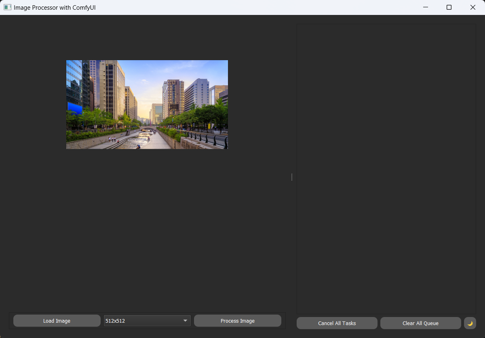

# PyQt5 Desktop Application

An experimental desktop application was developed using PyQt5 to provide a user-friendly interface for the ComfyUI workflow. The application’s primary goals include:

- **Launching a ComfyUI server in the background**
- **Presenting a simplified interface for end-users**
- **Managing all ComfyUI operations seamlessly**

This development effort resulted in significant progress, though not all planned features were completed at the time of project conclusion. Below is a summary of both the fully implemented features and the features still under development.

## Completed Features
- **ComfyUI Server Integration:** The application successfully launches and manages a ComfyUI server instance in the background without requiring direct user intervention.
- **User Interface Design:** A basic but functional interface was developed, allowing users to interact with key ComfyUI functionalities in an intuitive manner.
- **Task Management:** Core tasks such as starting, stopping, and monitoring the ComfyUI processes were fully integrated into the desktop application.
- **Error Handling & Logs:** Basic error handling was implemented, including logging of any server or user interface-related issues.

## Ongoing Development
- **Advanced UI/UX Enhancements:** Further refinements to improve usability, including better navigation, responsive design, and theme support, are under development.
- **Customizable Workflow Management:** Integration of a system for users to create, save, and load custom ComfyUI workflows within the application is in progress.
- **Automated Update Mechanism:** A feature for automatically checking for updates to the ComfyUI server and applying them is under design.
- **Extended Error Handling & Notifications:** Improvements to error reporting and real-time notifications for server or user errors are planned for future releases.

All relevant documentation and code for this experimental study can be found in the [`experimental_studies/`](./experimental_studies/) directory.

