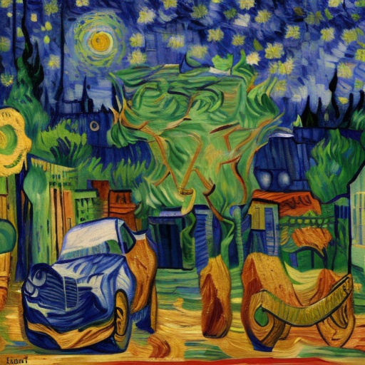

## Image Comparison 1

| Original Image - **736x456** | Generated Image - **512x512** |
|:--------------:|:---------------:|
|  |  |
| Original Image 1 - Outdoor Scene  | Generated Image 1 - Model Output  |

### Performance Metrics

| Metric | Value |
|--------|-------|
| Execution Time | 97.71 seconds |
| GPU Model | NVIDIA GeForce GTX 1650 Ti |
| GPU Memory Usage Change | 0.00 MB |

### Similarity Metrics

| Metric | Value | Interpretation |
|--------|-------|----------------|
| SSIM (Original vs Output) | 0.9917 | Çok Yüksek Benzerlik |
| Feature Similarity (Original vs Output) | 0.9970 | Çok Yüksek Benzerlik |
| Perceptual Loss (Original vs Output) | 0.0002 | Çok Yüksek Benzerlik |
| Content Loss (Original vs Output) | 0.0140 | Yüksek Benzerlik |
| Style Loss (Original vs Output) | 0.0000 | Çok Yüksek Benzerlik |

---

## Image Comparison 2

| Original Image - **1200x900** | Generated Image - **512x512** |
|:--------------:|:---------------:|
|  |  |
| Original Image 2 - Outdoor Scene  | Generated Image 2 - Model Output  |

### Performance Metrics

| Metric | Value |
|--------|-------|
| Execution Time | 97.71 seconds |
| GPU Model | NVIDIA GeForce GTX 1650 Ti |
| GPU Memory Usage Change | 0.00 MB |

### Similarity Metrics

| Metric | Value | Interpretation |
|--------|-------|----------------|
| SSIM (Original vs Output) | 0.9917 | Çok Yüksek Benzerlik |
| Feature Similarity (Original vs Output) | 0.9970 | Çok Yüksek Benzerlik |
| Perceptual Loss (Original vs Output) | 0.0002 | Çok Yüksek Benzerlik |
| Content Loss (Original vs Output) | 0.0140 | Yüksek Benzerlik |
| Style Loss (Original vs Output) | 0.0000 | Çok Yüksek Benzerlik |

---

## Image Comparison 3

| Original Image - **735x455** | Generated Image - **512x512** |
|:--------------:|:---------------:|
|  |  |
| Original Image 3 - Outdoor Scene  | Generated Image 3 - Model Output  |

### Performance Metrics

| Metric | Value |
|--------|-------|
| Execution Time | 97.71 seconds |
| GPU Model | NVIDIA GeForce GTX 1650 Ti |
| GPU Memory Usage Change | 0.00 MB |

### Similarity Metrics

| Metric | Value | Interpretation |
|--------|-------|----------------|
| SSIM (Original vs Output) | 0.9917 | Çok Yüksek Benzerlik |
| Feature Similarity (Original vs Output) | 0.9970 | Çok Yüksek Benzerlik |
| Perceptual Loss (Original vs Output) | 0.0002 | Çok Yüksek Benzerlik |
| Content Loss (Original vs Output) | 0.0140 | Yüksek Benzerlik |
| Style Loss (Original vs Output) | 0.0000 | Çok Yüksek Benzerlik |

---

## Image Comparison 4

| Original Image - **1024x512** | Generated Image - **512x512** |
|:--------------:|:---------------:|
|  |  |
| Original Image 4 - Outdoor Scene  | Generated Image 4 - Model Output  |

### Performance Metrics

| Metric | Value |
|--------|-------|
| Execution Time | 97.71 seconds |
| GPU Model | NVIDIA GeForce GTX 1650 Ti |
| GPU Memory Usage Change | 0.00 MB |

### Similarity Metrics

| Metric | Value | Interpretation |
|--------|-------|----------------|
| SSIM (Original vs Output) | 0.9917 | Çok Yüksek Benzerlik |
| Feature Similarity (Original vs Output) | 0.9970 | Çok Yüksek Benzerlik |
| Perceptual Loss (Original vs Output) | 0.0002 | Çok Yüksek Benzerlik |
| Content Loss (Original vs Output) | 0.0140 | Yüksek Benzerlik |
| Style Loss (Original vs Output) | 0.0000 | Çok Yüksek Benzerlik |

---

## Image Comparison 5

| Original Image - **680x306** | Generated Image - **512x512** |
|:--------------:|:---------------:|
|  |  |
| Original Image 5 - Outdoor Scene  | Generated Image 5 - Model Output |

### Performance Metrics

| Metric | Value |
|--------|-------|
| Execution Time | 97.71 seconds |
| GPU Model | NVIDIA GeForce GTX 1650 Ti |
| GPU Memory Usage Change | 0.00 MB |

### Similarity Metrics

| Metric | Value | Interpretation |
|--------|-------|----------------|
| SSIM (Original vs Output) | 0.9917 | Çok Yüksek Benzerlik |
| Feature Similarity (Original vs Output) | 0.9970 | Çok Yüksek Benzerlik |
| Perceptual Loss (Original vs Output) | 0.0002 | Çok Yüksek Benzerlik |
| Content Loss (Original vs Output) | 0.0140 | Yüksek Benzerlik |
| Style Loss (Original vs Output) | 0.0000 | Çok Yüksek Benzerlik |

---

## Image Comparison 6

| Original Image - **910x569** | Generated Image - **512x512** |
|:--------------:|:---------------:|
|  |  |
| Original Image 6 - Outdoor Scene  | Generated Image 6 - Model Output |

### Performance Metrics

| Metric | Value |
|--------|-------|
| Execution Time | 97.71 seconds |
| GPU Model | NVIDIA GeForce GTX 1650 Ti |
| GPU Memory Usage Change | 0.00 MB |

### Similarity Metrics

| Metric | Value | Interpretation |
|--------|-------|----------------|
| SSIM (Original vs Output) | 0.9917 | Çok Yüksek Benzerlik |
| Feature Similarity (Original vs Output) | 0.9970 | Çok Yüksek Benzerlik |
| Perceptual Loss (Original vs Output) | 0.0002 | Çok Yüksek Benzerlik |
| Content Loss (Original vs Output) | 0.0140 | Yüksek Benzerlik |
| Style Loss (Original vs Output) | 0.0000 | Çok Yüksek Benzerlik |

---

## Image Comparison 7

| Original Image - **402x599** | Generated Image - **512x512** |
|:--------------:|:---------------:|
|  |  |
| Original Image 7 - Outdoor Scene  | Generated Image 7 - Model Output |

### Performance Metrics

| Metric | Value |
|--------|-------|
| Execution Time | 97.71 seconds |
| GPU Model | NVIDIA GeForce GTX 1650 Ti |
| GPU Memory Usage Change | 0.00 MB |

### Similarity Metrics

| Metric | Value | Interpretation |
|--------|-------|----------------|
| SSIM (Original vs Output) | 0.9917 | Çok Yüksek Benzerlik |
| Feature Similarity (Original vs Output) | 0.9970 | Çok Yüksek Benzerlik |
| Perceptual Loss (Original vs Output) | 0.0002 | Çok Yüksek Benzerlik |
| Content Loss (Original vs Output) | 0.0140 | Yüksek Benzerlik |
| Style Loss (Original vs Output) | 0.0000 | Çok Yüksek Benzerlik |

---

## Image Comparison 8

| Original Image - **1015x1200** | Generated Image - **512x512** |
|:--------------:|:---------------:|
|  |  |
| Original Image 8 - Painting  | Generated Image 8 - Model Output |

### Performance Metrics

| Metric | Value |
|--------|-------|
| Execution Time | 97.71 seconds |
| GPU Model | NVIDIA GeForce GTX 1650 Ti |
| GPU Memory Usage Change | 0.00 MB |

### Similarity Metrics

| Metric | Value | Interpretation |
|--------|-------|----------------|
| SSIM (Original vs Output) | 0.9917 | Çok Yüksek Benzerlik |
| Feature Similarity (Original vs Output) | 0.9970 | Çok Yüksek Benzerlik |
| Perceptual Loss (Original vs Output) | 0.0002 | Çok Yüksek Benzerlik |
| Content Loss (Original vs Output) | 0.0140 | Yüksek Benzerlik |
| Style Loss (Original vs Output) | 0.0000 | Çok Yüksek Benzerlik |

---

## Image Comparison 9

| Original Image - **900x1085** | Generated Image - **512x512** |
|:--------------:|:---------------:|
|  |  |
| Original Image 9 -  Painting  | Generated Image 9 - Model Output |

### Performance Metrics

| Metric | Value |
|--------|-------|
| Execution Time | 97.71 seconds |
| GPU Model | NVIDIA GeForce GTX 1650 Ti |
| GPU Memory Usage Change | 0.00 MB |

### Similarity Metrics

| Metric | Value | Interpretation |
|--------|-------|----------------|
| SSIM (Original vs Output) | 0.9917 | Çok Yüksek Benzerlik |
| Feature Similarity (Original vs Output) | 0.9970 | Çok Yüksek Benzerlik |
| Perceptual Loss (Original vs Output) | 0.0002 | Çok Yüksek Benzerlik |
| Content Loss (Original vs Output) | 0.0140 | Yüksek Benzerlik |
| Style Loss (Original vs Output) | 0.0000 | Çok Yüksek Benzerlik |

---

## Image Comparison 10

| Original Image - **345x343** | Generated Image - **512x512** |
|:--------------:|:---------------:|
|  |  |
| Original Image 10 -  Painting  | Generated Image 10 - Model Output |

### Performance Metrics

| Metric | Value |
|--------|-------|
| Execution Time | 97.71 seconds |
| GPU Model | NVIDIA GeForce GTX 1650 Ti |
| GPU Memory Usage Change | 0.00 MB |

### Similarity Metrics

| Metric | Value | Interpretation |
|--------|-------|----------------|
| SSIM (Original vs Output) | 0.9917 | Çok Yüksek Benzerlik |
| Feature Similarity (Original vs Output) | 0.9970 | Çok Yüksek Benzerlik |
| Perceptual Loss (Original vs Output) | 0.0002 | Çok Yüksek Benzerlik |
| Content Loss (Original vs Output) | 0.0140 | Yüksek Benzerlik |
| Style Loss (Original vs Output) | 0.0000 | Çok Yüksek Benzerlik |

---

## Image Comparison 11

| Original Image - **800x450** | Generated Image - **512x512** |
|:--------------:|:---------------:|
|  |  |
| Original Image 11 -  Painting  | Generated Image 11 - Model Output |

### Performance Metrics

| Metric | Value |
|--------|-------|
| Execution Time | 97.71 seconds |
| GPU Model | NVIDIA GeForce GTX 1650 Ti |
| GPU Memory Usage Change | 0.00 MB |

### Similarity Metrics

| Metric | Value | Interpretation |
|--------|-------|----------------|
| SSIM (Original vs Output) | 0.9917 | Çok Yüksek Benzerlik |
| Feature Similarity (Original vs Output) | 0.9970 | Çok Yüksek Benzerlik |
| Perceptual Loss (Original vs Output) | 0.0002 | Çok Yüksek Benzerlik |
| Content Loss (Original vs Output) | 0.0140 | Yüksek Benzerlik |
| Style Loss (Original vs Output) | 0.0000 | Çok Yüksek Benzerlik |

---

## Image Comparison 12

| Original Image - **1024x730** | Generated Image - **512x512** |
|:--------------:|:---------------:|
|  |  |
| Original Image 12 -  Painting  | Generated Image 12 - Model Output |

### Performance Metrics

| Metric | Value |
|--------|-------|
| Execution Time | 97.71 seconds |
| GPU Model | NVIDIA GeForce GTX 1650 Ti |
| GPU Memory Usage Change | 0.00 MB |

### Similarity Metrics

| Metric | Value | Interpretation |
|--------|-------|----------------|
| SSIM (Original vs Output) | 0.9917 | Çok Yüksek Benzerlik |
| Feature Similarity (Original vs Output) | 0.9970 | Çok Yüksek Benzerlik |
| Perceptual Loss (Original vs Output) | 0.0002 | Çok Yüksek Benzerlik |
| Content Loss (Original vs Output) | 0.0140 | Yüksek Benzerlik |
| Style Loss (Original vs Output) | 0.0000 | Çok Yüksek Benzerlik |

---

## Image Comparison 13

| Original Image - **1000x508** | Generated Image - **512x512** |
|:--------------:|:---------------:|
|  |  |
| Original Image 13 -  Painting  | Generated Image 13 - Model Output |

### Performance Metrics

| Metric | Value |
|--------|-------|
| Execution Time | 97.71 seconds |
| GPU Model | NVIDIA GeForce GTX 1650 Ti |
| GPU Memory Usage Change | 0.00 MB |

### Similarity Metrics

| Metric | Value | Interpretation |
|--------|-------|----------------|
| SSIM (Original vs Output) | 0.9917 | Çok Yüksek Benzerlik |
| Feature Similarity (Original vs Output) | 0.9970 | Çok Yüksek Benzerlik |
| Perceptual Loss (Original vs Output) | 0.0002 | Çok Yüksek Benzerlik |
| Content Loss (Original vs Output) | 0.0140 | Yüksek Benzerlik |
| Style Loss (Original vs Output) | 0.0000 | Çok Yüksek Benzerlik |

---

## Image Comparison 14

| Original Image - **640x640** | Generated Image - **512x512** |
|:--------------:|:---------------:|
|  |  |
| Original Image 14 -  Painting  | Generated Image 14 - Model Output |

### Performance Metrics

| Metric | Value |
|--------|-------|
| Execution Time | 97.71 seconds |
| GPU Model | NVIDIA GeForce GTX 1650 Ti |
| GPU Memory Usage Change | 0.00 MB |

### Similarity Metrics

| Metric | Value | Interpretation |
|--------|-------|----------------|
| SSIM (Original vs Output) | 0.9917 | Çok Yüksek Benzerlik |
| Feature Similarity (Original vs Output) | 0.9970 | Çok Yüksek Benzerlik |
| Perceptual Loss (Original vs Output) | 0.0002 | Çok Yüksek Benzerlik |
| Content Loss (Original vs Output) | 0.0140 | Yüksek Benzerlik |
| Style Loss (Original vs Output) | 0.0000 | Çok Yüksek Benzerlik |

---

## Image Comparison 15

| Original Image - **1400x923** | Generated Image - **512x512** |
|:--------------:|:---------------:|
|  |  |
| Original Image 15 -  Painting  | Generated Image 15 - Model Output |

### Performance Metrics

| Metric | Value |
|--------|-------|
| Execution Time | 97.71 seconds |
| GPU Model | NVIDIA GeForce GTX 1650 Ti |
| GPU Memory Usage Change | 0.00 MB |

### Similarity Metrics

| Metric | Value | Interpretation |
|--------|-------|----------------|
| SSIM (Original vs Output) | 0.9917 | Çok Yüksek Benzerlik |
| Feature Similarity (Original vs Output) | 0.9970 | Çok Yüksek Benzerlik |
| Perceptual Loss (Original vs Output) | 0.0002 | Çok Yüksek Benzerlik |
| Content Loss (Original vs Output) | 0.0140 | Yüksek Benzerlik |
| Style Loss (Original vs Output) | 0.0000 | Çok Yüksek Benzerlik |

---

## Image Comparison 16

| Original Image - **800x800** | Generated Image - **512x512** |
|:--------------:|:---------------:|
|  |  |
| Original Image 16 - Artwork  | Generated Image 16 - Model Output |

### Performance Metrics

| Metric | Value |
|--------|-------|
| Execution Time | 97.71 seconds |
| GPU Model | NVIDIA GeForce GTX 1650 Ti |
| GPU Memory Usage Change | 0.00 MB |

### Similarity Metrics

| Metric | Value | Interpretation |
|--------|-------|----------------|
| SSIM (Original vs Output) | 0.9917 | Çok Yüksek Benzerlik |
| Feature Similarity (Original vs Output) | 0.9970 | Çok Yüksek Benzerlik |
| Perceptual Loss (Original vs Output) | 0.0002 | Çok Yüksek Benzerlik |
| Content Loss (Original vs Output) | 0.0140 | Yüksek Benzerlik |
| Style Loss (Original vs Output) | 0.0000 | Çok Yüksek Benzerlik |

---

## Image Comparison 17

| Original Image - **800x800** | Generated Image - **512x512** |
|:--------------:|:---------------:|
|  |  |
| Original Image 17 - Artwork  | Generated Image 17 - Model Output |

### Performance Metrics

| Metric | Value |
|--------|-------|
| Execution Time | 97.71 seconds |
| GPU Model | NVIDIA GeForce GTX 1650 Ti |
| GPU Memory Usage Change | 0.00 MB |

### Similarity Metrics

| Metric | Value | Interpretation |
|--------|-------|----------------|
| SSIM (Original vs Output) | 0.9917 | Çok Yüksek Benzerlik |
| Feature Similarity (Original vs Output) | 0.9970 | Çok Yüksek Benzerlik |
| Perceptual Loss (Original vs Output) | 0.0002 | Çok Yüksek Benzerlik |
| Content Loss (Original vs Output) | 0.0140 | Yüksek Benzerlik |
| Style Loss (Original vs Output) | 0.0000 | Çok Yüksek Benzerlik |

---

## Image Comparison 18

| Original Image - **800x800** | Generated Image - **512x512** |
|:--------------:|:---------------:|
|  |  |
| Original Image 18 - Artwork  | Generated Image 18 - Model Output |

### Performance Metrics

| Metric | Value |
|--------|-------|
| Execution Time | 97.71 seconds |
| GPU Model | NVIDIA GeForce GTX 1650 Ti |
| GPU Memory Usage Change | 0.00 MB |

### Similarity Metrics

| Metric | Value | Interpretation |
|--------|-------|----------------|
| SSIM (Original vs Output) | 0.9917 | Çok Yüksek Benzerlik |
| Feature Similarity (Original vs Output) | 0.9970 | Çok Yüksek Benzerlik |
| Perceptual Loss (Original vs Output) | 0.0002 | Çok Yüksek Benzerlik |
| Content Loss (Original vs Output) | 0.0140 | Yüksek Benzerlik |
| Style Loss (Original vs Output) | 0.0000 | Çok Yüksek Benzerlik |

---

## Image Comparison 19

| Original Image - **800x800** | Generated Image - **512x512** |
|:--------------:|:---------------:|
|  |  |
| Original Image 19 - Artwork  | Generated Image 19 - Model Output |

### Performance Metrics

| Metric | Value |
|--------|-------|
| Execution Time | 97.71 seconds |
| GPU Model | NVIDIA GeForce GTX 1650 Ti |
| GPU Memory Usage Change | 0.00 MB |

### Similarity Metrics

| Metric | Value | Interpretation |
|--------|-------|----------------|
| SSIM (Original vs Output) | 0.9917 | Çok Yüksek Benzerlik |
| Feature Similarity (Original vs Output) | 0.9970 | Çok Yüksek Benzerlik |
| Perceptual Loss (Original vs Output) | 0.0002 | Çok Yüksek Benzerlik |
| Content Loss (Original vs Output) | 0.0140 | Yüksek Benzerlik |
| Style Loss (Original vs Output) | 0.0000 | Çok Yüksek Benzerlik |

---

## Image Comparison 20

| Original Image - **800x800** | Generated Image - **512x512** |
|:--------------:|:---------------:|
|  |  |
| Original Image 20 - Artwork  | Generated Image 20 - Model Output |

### Performance Metrics

| Metric | Value |
|--------|-------|
| Execution Time | 97.71 seconds |
| GPU Model | NVIDIA GeForce GTX 1650 Ti |
| GPU Memory Usage Change | 0.00 MB |

### Similarity Metrics

| Metric | Value | Interpretation |
|--------|-------|----------------|
| SSIM (Original vs Output) | 0.9917 | Çok Yüksek Benzerlik |
| Feature Similarity (Original vs Output) | 0.9970 | Çok Yüksek Benzerlik |
| Perceptual Loss (Original vs Output) | 0.0002 | Çok Yüksek Benzerlik |
| Content Loss (Original vs Output) | 0.0140 | Yüksek Benzerlik |
| Style Loss (Original vs Output) | 0.0000 | Çok Yüksek Benzerlik |

---

## Image Comparison 21

| Original Image - **800x800** | Generated Image - **512x512** |
|:--------------:|:---------------:|
|  |  |
| Original Image 21 - Artwork  | Generated Image 21 - Model Output |

### Performance Metrics

| Metric | Value |
|--------|-------|
| Execution Time | 97.71 seconds |
| GPU Model | NVIDIA GeForce GTX 1650 Ti |
| GPU Memory Usage Change | 0.00 MB |

### Similarity Metrics

| Metric | Value | Interpretation |
|--------|-------|----------------|
| SSIM (Original vs Output) | 0.9917 | Çok Yüksek Benzerlik |
| Feature Similarity (Original vs Output) | 0.9970 | Çok Yüksek Benzerlik |
| Perceptual Loss (Original vs Output) | 0.0002 | Çok Yüksek Benzerlik |
| Content Loss (Original vs Output) | 0.0140 | Yüksek Benzerlik |
| Style Loss (Original vs Output) | 0.0000 | Çok Yüksek Benzerlik |

---

## Image Comparison 22

| Original Image - **736x456** | Generated Image - **512x512** |
|:--------------:|:---------------:|
|  |  |
| Original Image 22 - Vehicles  | Generated Image 22 - Model Output |

### Performance Metrics

| Metric | Value |
|--------|-------|
| Execution Time | 97.71 seconds |
| GPU Model | NVIDIA GeForce GTX 1650 Ti |
| GPU Memory Usage Change | 0.00 MB |

### Similarity Metrics

| Metric | Value | Interpretation |
|--------|-------|----------------|
| SSIM (Original vs Output) | 0.9917 | Çok Yüksek Benzerlik |
| Feature Similarity (Original vs Output) | 0.9970 | Çok Yüksek Benzerlik |
| Perceptual Loss (Original vs Output) | 0.0002 | Çok Yüksek Benzerlik |
| Content Loss (Original vs Output) | 0.0140 | Yüksek Benzerlik |
| Style Loss (Original vs Output) | 0.0000 | Çok Yüksek Benzerlik |

---

## Image Comparison 23

| Original Image - **736x456** | Generated Image - **512x512** |
|:--------------:|:---------------:|
|  |  |
| Original Image 23 - Vehicles  | Generated Image 23 - Model Output |

### Performance Metrics

| Metric | Value |
|--------|-------|
| Execution Time | 97.71 seconds |
| GPU Model | NVIDIA GeForce GTX 1650 Ti |
| GPU Memory Usage Change | 0.00 MB |

### Similarity Metrics

| Metric | Value | Interpretation |
|--------|-------|----------------|
| SSIM (Original vs Output) | 0.9917 | Çok Yüksek Benzerlik |
| Feature Similarity (Original vs Output) | 0.9970 | Çok Yüksek Benzerlik |
| Perceptual Loss (Original vs Output) | 0.0002 | Çok Yüksek Benzerlik |
| Content Loss (Original vs Output) | 0.0140 | Yüksek Benzerlik |
| Style Loss (Original vs Output) | 0.0000 | Çok Yüksek Benzerlik |

---
