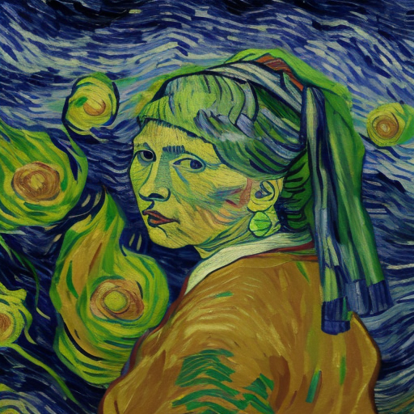
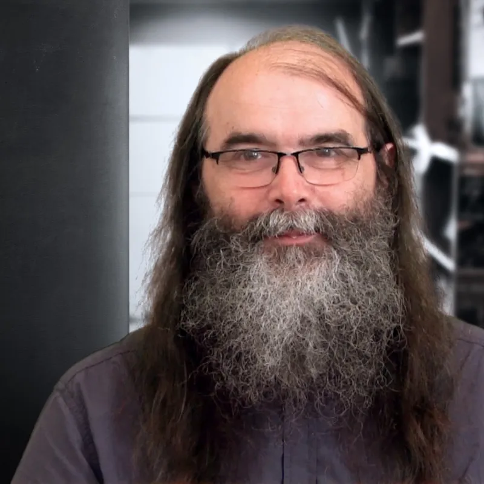
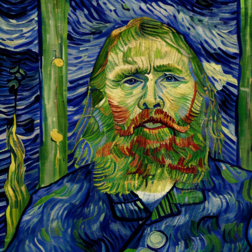
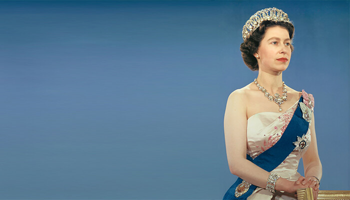
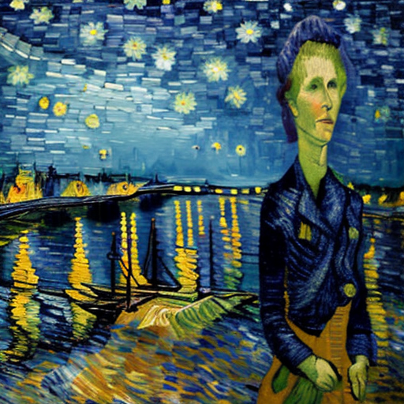
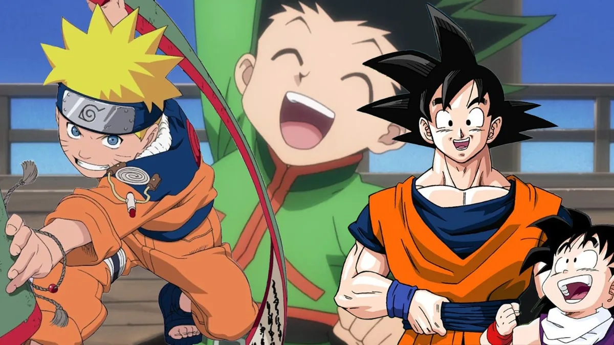
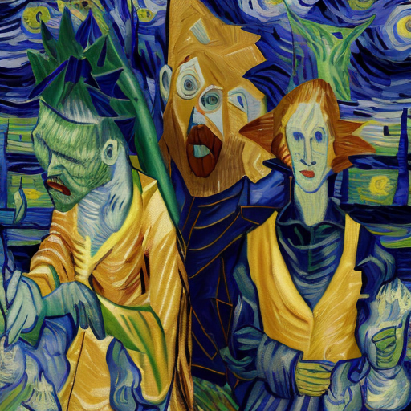
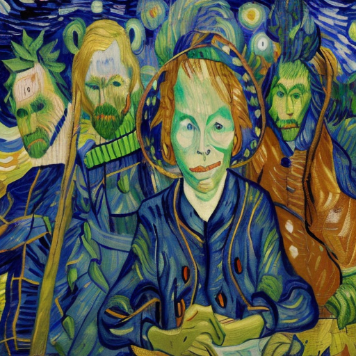

## Image Comparison 1

| Original Image - **800x450** | Generated Image - **512x512** |
|:--------------:|:---------------:|
|  |  |
| Original Image 1 - Outdoor Scene  | Generated Image 1 - Model Output  |

### Performance Metrics

| Metric | Value |
|--------|-------|
| Execution Time | 153.94 seconds |
| GPU Model | NVIDIA GeForce GTX 1650 Ti |
| GPU Memory Usage Change | -112.29 MB |

#### Similarity Metrics
| Metric | Value | Interpretation |
|--------|-------|----------------|
| SSIM (Original vs Output) | 0.9923 | Çok Yüksek Benzerlik |
| Feature Similarity (Original vs Output) | 0.9976 | Çok Yüksek Benzerlik |
| Perceptual Loss (Original vs Output) | 0.0002 | Çok Yüksek Benzerlik |
| Content Loss (Original vs Output) | 0.0207 | Yüksek Benzerlik |
| Style Loss (Original vs Output) | 0.0000 | Çok Yüksek Benzerlik |

---

## Image Comparison 2

| Original Image - **1000x667** | Generated Image - **512x512** |
|:--------------:|:---------------:|
|  |  |
| Original Image 2 - Outdoor Scene  | Generated Image 2 - Model Output  |

### Performance Metrics

| Metric | Value |
|--------|-------|
| Execution Time | 105.41 seconds |
| GPU Model | NVIDIA GeForce GTX 1650 Ti |
| GPU Memory Usage Change | 0.00 MB |

#### Similarity Metrics
| Metric | Value | Interpretation |
|--------|-------|----------------|
| SSIM (Original vs Output) | 0.9931 | Çok Yüksek Benzerlik |
| Feature Similarity (Original vs Output) | 0.9980 | Çok Yüksek Benzerlik |
| Perceptual Loss (Original vs Output) | 0.0002 | Çok Yüksek Benzerlik |
| Content Loss (Original vs Output) | 0.0132 | Yüksek Benzerlik |
| Style Loss (Original vs Output) | 0.0000 | Çok Yüksek Benzerlik |

---

## Image Comparison 3

| Original Image - **830x415** | Generated Image - **512x512** |
|:--------------:|:---------------:|
|  |  |
| Original Image 3 - Outdoor Scene  | Generated Image 3 - Model Output  |

### Performance Metrics

| Metric | Value |
|--------|-------|
| Execution Time | 606.66 seconds |
| GPU Model | NVIDIA GeForce GTX 1650 Ti |
| GPU Memory Usage Change | 0.00 MB |

#### Similarity Metrics
| Metric | Value | Interpretation |
|--------|-------|----------------|
| SSIM (Original vs Output) | 0.9912 | Çok Yüksek Benzerlik |
| Feature Similarity (Original vs Output) | 0.9985 | Çok Yüksek Benzerlik |
| Perceptual Loss (Original vs Output) | 0.0001 | Çok Yüksek Benzerlik |
| Content Loss (Original vs Output) | 0.0133 | Yüksek Benzerlik |
| Style Loss (Original vs Output) | 0.0000 | Çok Yüksek Benzerlik |

---

## Image Comparison 4

| Original Image - **640x359** | Generated Image - **512x512** |
|:--------------:|:---------------:|
|  |  |
| Original Image 4 - Outdoor Scene  | Generated Image 4 - Model Output  |

### Performance Metrics

| Metric | Value |
|--------|-------|
| Execution Time | 92.72 seconds |
| GPU Model | NVIDIA GeForce GTX 1650 Ti |
| GPU Memory Usage Change | 0.00 MB |

#### Similarity Metrics
| Metric | Value | Interpretation |
|--------|-------|----------------|
| SSIM (Original vs Output) | 0.9905 | Çok Yüksek Benzerlik |
| Feature Similarity (Original vs Output) | 0.9983 | Çok Yüksek Benzerlik |
| Perceptual Loss (Original vs Output) | 0.0002 | Çok Yüksek Benzerlik |
| Content Loss (Original vs Output) | 0.0154 | Yüksek Benzerlik |
| Style Loss (Original vs Output) | 0.0000 | Çok Yüksek Benzerlik |

---

## Image Comparison 5

| Original Image - **600x397** | Generated Image - **512x512** |
|:--------------:|:---------------:|
|  |  |
| Original Image 5 - Outdoor Scene  | Generated Image 5 - Model Output |

### Performance Metrics

| Metric | Value |
|--------|-------|
| Execution Time | 448.20 seconds |
| GPU Model | NVIDIA GeForce GTX 1650 Ti |
| GPU Memory Usage Change | 0.00 MB |

#### Similarity Metrics
| Metric | Value | Interpretation |
|--------|-------|----------------|
| SSIM (Original vs Output) | 0.9873 | Çok Yüksek Benzerlik |
| Feature Similarity (Original vs Output) | 0.9934 | Çok Yüksek Benzerlik |
| Perceptual Loss (Original vs Output) | 0.0006 | Çok Yüksek Benzerlik |
| Content Loss (Original vs Output) | 0.0512 | Yüksek Benzerlik |
| Style Loss (Original vs Output) | 0.0000 | Çok Yüksek Benzerlik |

---

## Image Comparison 6

| Original Image - **4000x2200** | Generated Image - **512x512** |
|:--------------:|:---------------:|
|  |  |
| Original Image 6 - Outdoor Scene  | Generated Image 6 - Model Output |

### Performance Metrics

| Metric | Value |
|--------|-------|
| Execution Time | 100.35 seconds |
| GPU Model | NVIDIA GeForce GTX 1650 Ti |
| GPU Memory Usage Change | 0.00 MB |

#### Similarity Metrics
| Metric | Value | Interpretation |
|--------|-------|----------------|
| SSIM (Original vs Output) | 0.9908 | Çok Yüksek Benzerlik |
| Feature Similarity (Original vs Output) | 0.9985 | Çok Yüksek Benzerlik |
| Perceptual Loss (Original vs Output) | 0.0001 | Çok Yüksek Benzerlik |
| Content Loss (Original vs Output) | 0.0124 | Yüksek Benzerlik |
| Style Loss (Original vs Output) | 0.0000 | Çok Yüksek Benzerlik |

---

## Image Comparison 7

| Original Image - **1920x1080** | Generated Image - **512x512** |
|:--------------:|:---------------:|
|  |  |
| Original Image 7 - Outdoor Scene  | Generated Image 7 - Model Output |

### Performance Metrics

| Metric | Value |
|--------|-------|
| Execution Time | 286.12 seconds |
| GPU Model | NVIDIA GeForce GTX 1650 Ti |
| GPU Memory Usage Change | 0.00 MB |

#### Similarity Metrics
| Metric | Value | Interpretation |
|--------|-------|----------------|
| SSIM (Original vs Output) | 0.9920 | Çok Yüksek Benzerlik |
| Feature Similarity (Original vs Output) | 0.9991 | Çok Yüksek Benzerlik |
| Perceptual Loss (Original vs Output) | 0.0001 | Çok Yüksek Benzerlik |
| Content Loss (Original vs Output) | 0.0138 | Yüksek Benzerlik |
| Style Loss (Original vs Output) | 0.0000 | Çok Yüksek Benzerlik |

---

## Image Comparison 8

| Original Image - **1280x720** | Generated Image - **512x512** |
|:--------------:|:---------------:|
|  |  |
| Original Image 8 - Painting  | Generated Image 8 - Model Output |

### Performance Metrics

| Metric | Value |
|--------|-------|
| Execution Time | 100.87 seconds |
| GPU Model | NVIDIA GeForce GTX 1650 Ti |
| GPU Memory Usage Change | 0.00 MB |

#### Similarity Metrics
| Metric | Value | Interpretation |
|--------|-------|----------------|
| SSIM (Original vs Output) | 0.9898 | Çok Yüksek Benzerlik |
| Feature Similarity (Original vs Output) | 0.9979 | Çok Yüksek Benzerlik |
| Perceptual Loss (Original vs Output) | 0.0002 | Çok Yüksek Benzerlik |
| Content Loss (Original vs Output) | 0.0162 | Yüksek Benzerlik |
| Style Loss (Original vs Output) | 0.0000 | Çok Yüksek Benzerlik |

---

## Image Comparison 9

| Original Image - **735x431** | Generated Image - **512x512** |
|:--------------:|:---------------:|
|  |  |
| Original Image 9 -  Painting  | Generated Image 9 - Model Output |

### Performance Metrics

| Metric | Value |
|--------|-------|
| Execution Time | 200.20 seconds |
| GPU Model | NVIDIA GeForce GTX 1650 Ti |
| GPU Memory Usage Change | 0.00 MB |

#### Similarity Metrics
| Metric | Value | Interpretation |
|--------|-------|----------------|
| SSIM (Original vs Output) | 0.9887 | Çok Yüksek Benzerlik |
| Feature Similarity (Original vs Output) | 0.9945 | Çok Yüksek Benzerlik |
| Perceptual Loss (Original vs Output) | 0.0002 | Çok Yüksek Benzerlik |
| Content Loss (Original vs Output) | 0.0264 | Yüksek Benzerlik |
| Style Loss (Original vs Output) | 0.0000 | Çok Yüksek Benzerlik |

---

## Image Comparison 10

| Original Image - **736x456** | Generated Image - **512x512** |
|:--------------:|:---------------:|
|  |  |
| Original Image 10 -  Painting  | Generated Image 10 - Model Output |

### Performance Metrics

| Metric | Value |
|--------|-------|
| Execution Time | 97.71 seconds |
| GPU Model | NVIDIA GeForce GTX 1650 Ti |
| GPU Memory Usage Change | 0.00 MB |

#### Similarity Metrics
| Metric | Value | Interpretation |
|--------|-------|----------------|
| SSIM (Original vs Output) | 0.9917 | Çok Yüksek Benzerlik |
| Feature Similarity (Original vs Output) | 0.9970 | Çok Yüksek Benzerlik |
| Perceptual Loss (Original vs Output) | 0.0002 | Çok Yüksek Benzerlik |
| Content Loss (Original vs Output) | 0.0140 | Yüksek Benzerlik |
| Style Loss (Original vs Output) | 0.0000 | Çok Yüksek Benzerlik |

---

## Image Comparison 11

| Original Image - **1200x900** | Generated Image - **512x512** |
|:--------------:|:---------------:|
|  |  |
| Original Image 11 -  Painting  | Generated Image 11 - Model Output |

### Performance Metrics

| Metric | Value |
|--------|-------|
| Execution Time | 96.61 seconds |
| GPU Model | NVIDIA GeForce GTX 1650 Ti |
| GPU Memory Usage Change | 0.00 MB |

#### Similarity Metrics
| Metric | Value | Interpretation |
|--------|-------|----------------|
| SSIM (Original vs Output) | 0.9917 | Çok Yüksek Benzerlik |
| Feature Similarity (Original vs Output) | 0.9985 | Çok Yüksek Benzerlik |
| Perceptual Loss (Original vs Output) | 0.0002 | Çok Yüksek Benzerlik |
| Content Loss (Original vs Output) | 0.0187 | Yüksek Benzerlik |
| Style Loss (Original vs Output) | 0.0000 | Çok Yüksek Benzerlik |

---

## Image Comparison 12

| Original Image - **735x455** | Generated Image - **512x512** |
|:--------------:|:---------------:|
|  |  |
| Original Image 12 -  Painting  | Generated Image 12 - Model Output |

### Performance Metrics

| Metric | Value |
|--------|-------|
| Execution Time | 796.35 seconds |
| GPU Model | NVIDIA GeForce GTX 1650 Ti |
| GPU Memory Usage Change | 0.00 MB |

#### Similarity Metrics
| Metric | Value | Interpretation |
|--------|-------|----------------|
| SSIM (Original vs Output) | 0.9893 | Çok Yüksek Benzerlik |
| Feature Similarity (Original vs Output) | 0.9985 | Çok Yüksek Benzerlik |
| Perceptual Loss (Original vs Output) | 0.0002 | Çok Yüksek Benzerlik |
| Content Loss (Original vs Output) | 0.0155 | Yüksek Benzerlik |
| Style Loss (Original vs Output) | 0.0000 | Çok Yüksek Benzerlik |

---

## Image Comparison 13

| Original Image - **1024x512** | Generated Image - **512x512** |
|:--------------:|:---------------:|
|  |  |
| Original Image 13 -  Painting  | Generated Image 13 - Model Output |

### Performance Metrics

| Metric | Value |
|--------|-------|
| Execution Time | 105.73 seconds |
| GPU Model | NVIDIA GeForce GTX 1650 Ti |
| GPU Memory Usage Change | 507.68 MB |

#### Similarity Metrics
| Metric | Value | Interpretation |
|--------|-------|----------------|
| SSIM (Original vs Output) | 0.9909 | Çok Yüksek Benzerlik |
| Feature Similarity (Original vs Output) | 0.9994 | Çok Yüksek Benzerlik |
| Perceptual Loss (Original vs Output) | 0.0001 | Çok Yüksek Benzerlik |
| Content Loss (Original vs Output) | 0.0139 | Yüksek Benzerlik |
| Style Loss (Original vs Output) | 0.0000 | Çok Yüksek Benzerlik |

---

## Image Comparison 14

| Original Image - **680x306** | Generated Image - **512x512** |
|:--------------:|:---------------:|
|  |  |
| Original Image 14 -  Painting  | Generated Image 14 - Model Output |

### Performance Metrics

| Metric | Value |
|--------|-------|
| Execution Time | 349.89 seconds |
| GPU Model | NVIDIA GeForce GTX 1650 Ti |
| GPU Memory Usage Change | -0.28 MB |

#### Similarity Metrics
| Metric | Value | Interpretation |
|--------|-------|----------------|
| SSIM (Original vs Output) | 0.9915 | Çok Yüksek Benzerlik |
| Feature Similarity (Original vs Output) | 0.9968 | Çok Yüksek Benzerlik |
| Perceptual Loss (Original vs Output) | 0.0002 | Çok Yüksek Benzerlik |
| Content Loss (Original vs Output) | 0.0208 | Yüksek Benzerlik |
| Style Loss (Original vs Output) | 0.0000 | Çok Yüksek Benzerlik |

---

## Image Comparison 15

| Original Image - **910x569** | Generated Image - **512x512** |
|:--------------:|:---------------:|
|  |  |
| Original Image 15 -  Painting  | Generated Image 15 - Model Output |

### Performance Metrics

| Metric | Value |
|--------|-------|
| Execution Time | 339.10 seconds |
| GPU Model | NVIDIA GeForce GTX 1650 Ti |
| GPU Memory Usage Change | 0.00 MB |

#### Similarity Metrics
| Metric | Value | Interpretation |
|--------|-------|----------------|
| SSIM (Original vs Output) | 0.9914 | Çok Yüksek Benzerlik |
| Feature Similarity (Original vs Output) | 0.9969 | Çok Yüksek Benzerlik |
| Perceptual Loss (Original vs Output) | 0.0002 | Çok Yüksek Benzerlik |
| Content Loss (Original vs Output) | 0.0169 | Yüksek Benzerlik |
| Style Loss (Original vs Output) | 0.0000 | Çok Yüksek Benzerlik |

---

## Image Comparison 16

| Original Image - **402x599** | Generated Image - **512x512** |
|:--------------:|:---------------:|
|  |  |
| Original Image 16 - Artwork  | Generated Image 16 - Model Output |

### Performance Metrics

| Metric | Value |
|--------|-------|
| Execution Time | 592.36 seconds |
| GPU Model | NVIDIA GeForce GTX 1650 Ti |
| GPU Memory Usage Change | 0.00 MB |

#### Similarity Metrics
| Metric | Value | Interpretation |
|--------|-------|----------------|
| SSIM (Original vs Output) | 0.9914 | Çok Yüksek Benzerlik |
| Feature Similarity (Original vs Output) | 0.9959 | Çok Yüksek Benzerlik |
| Perceptual Loss (Original vs Output) | 0.0002 | Çok Yüksek Benzerlik |
| Content Loss (Original vs Output) | 0.0154 | Yüksek Benzerlik |
| Style Loss (Original vs Output) | 0.0000 | Çok Yüksek Benzerlik |

---

## Image Comparison 17

| Original Image - **1015x1200** | Generated Image - **512x512** |
|:--------------:|:---------------:|
|  |  |
| Original Image 17 - Artwork  | Generated Image 17 - Model Output |

### Performance Metrics

| Metric | Value |
|--------|-------|
| Execution Time | 404.72 seconds |
| GPU Model | NVIDIA GeForce GTX 1650 Ti |
| GPU Memory Usage Change | 0.00 MB |

#### Similarity Metrics
| Metric | Value | Interpretation |
|--------|-------|----------------|
| SSIM (Original vs Output) | 0.9885 | Çok Yüksek Benzerlik |
| Feature Similarity (Original vs Output) | 0.9979 | Çok Yüksek Benzerlik |
| Perceptual Loss (Original vs Output) | 0.0002 | Çok Yüksek Benzerlik |
| Content Loss (Original vs Output) | 0.0172 | Yüksek Benzerlik |
| Style Loss (Original vs Output) | 0.0000 | Çok Yüksek Benzerlik |

---

## Image Comparison 18

| Original Image - **900x1085** | Generated Image - **512x512** |
|:--------------:|:---------------:|
|  |  |
| Original Image 18 - Artwork  | Generated Image 18 - Model Output |

### Performance Metrics

| Metric | Value |
|--------|-------|
| Execution Time | 307.56 seconds |
| GPU Model | NVIDIA GeForce GTX 1650 Ti |
| GPU Memory Usage Change | 0.00 MB |

#### Similarity Metrics
| Metric | Value | Interpretation |
|--------|-------|----------------|
| SSIM (Original vs Output) | 0.9904 | Çok Yüksek Benzerlik |
| Feature Similarity (Original vs Output) | 0.9983 | Çok Yüksek Benzerlik |
| Perceptual Loss (Original vs Output) | 0.0002 | Çok Yüksek Benzerlik |
| Content Loss (Original vs Output) | 0.0171 | Yüksek Benzerlik |
| Style Loss (Original vs Output) | 0.0000 | Çok Yüksek Benzerlik |

---

## Image Comparison 19

| Original Image - **345x343** | Generated Image - **512x512** |
|:--------------:|:---------------:|
|  |  |
| Original Image 19 - Artwork  | Generated Image 19 - Model Output |

### Performance Metrics

| Metric | Value |
|--------|-------|
| Execution Time | 633.73 seconds |
| GPU Model | NVIDIA GeForce GTX 1650 Ti |
| GPU Memory Usage Change | 0.00 MB |

#### Similarity Metrics
| Metric | Value | Interpretation |
|--------|-------|----------------|
| SSIM (Original vs Output) | 0.9895 | Çok Yüksek Benzerlik |
| Feature Similarity (Original vs Output) | 0.9950 | Çok Yüksek Benzerlik |
| Perceptual Loss (Original vs Output) | 0.0002 | Çok Yüksek Benzerlik |
| Content Loss (Original vs Output) | 0.0224 | Yüksek Benzerlik |
| Style Loss (Original vs Output) | 0.0000 | Çok Yüksek Benzerlik |

---

## Image Comparison 20

| Original Image - **1024x730** | Generated Image - **512x512** |
|:--------------:|:---------------:|
|  |  |
| Original Image 20 - Artwork  | Generated Image 20 - Model Output |

### Performance Metrics

| Metric | Value |
|--------|-------|
| Execution Time | 450.47 seconds |
| GPU Model | NVIDIA GeForce GTX 1650 Ti |
| GPU Memory Usage Change | 0.00 MB |

#### Similarity Metrics
| Metric | Value | Interpretation |
|--------|-------|----------------|
| SSIM (Original vs Output) | 0.9905 | Çok Yüksek Benzerlik |
| Feature Similarity (Original vs Output) | 0.9975 | Çok Yüksek Benzerlik |
| Perceptual Loss (Original vs Output) | 0.0002 | Çok Yüksek Benzerlik |
| Content Loss (Original vs Output) | 0.0172 | Yüksek Benzerlik |
| Style Loss (Original vs Output) | 0.0000 | Çok Yüksek Benzerlik |

---

## Image Comparison 21

| Original Image - **1000x508** | Generated Image - **512x512** |
|:--------------:|:---------------:|
|  |  |
| Original Image 21 - Artwork  | Generated Image 21 - Model Output |

### Performance Metrics

| Metric | Value |
|--------|-------|
| Execution Time | 72081.05 seconds |
| GPU Model | NVIDIA GeForce GTX 1650 Ti |
| GPU Memory Usage Change | 0.00 MB |

#### Similarity Metrics
| Metric | Value | Interpretation |
|--------|-------|----------------|
| SSIM (Original vs Output) | 0.9884 | Çok Yüksek Benzerlik |
| Feature Similarity (Original vs Output) | 0.9988 | Çok Yüksek Benzerlik |
| Perceptual Loss (Original vs Output) | 0.0002 | Çok Yüksek Benzerlik |
| Content Loss (Original vs Output) | 0.0153 | Yüksek Benzerlik |
| Style Loss (Original vs Output) | 0.0000 | Çok Yüksek Benzerlik |

---

## Image Comparison 22

| Original Image - **640x360** | Generated Image - **512x512** |
|:--------------:|:---------------:|
|  |  |
| Original Image 22 - Vehicles  | Generated Image 22 - Model Output |

### Performance Metrics

| Metric | Value |
|--------|-------|
| Execution Time | 135.18 seconds |
| GPU Model | NVIDIA GeForce GTX 1650 Ti |
| GPU Memory Usage Change | 0.00 MB |

#### Similarity Metrics
| Metric | Value | Interpretation |
|--------|-------|----------------|
| SSIM (Original vs Output) | 0.9898 | Çok Yüksek Benzerlik |
| Feature Similarity (Original vs Output) | 0.9984 | Çok Yüksek Benzerlik |
| Perceptual Loss (Original vs Output) | 0.0002 | Çok Yüksek Benzerlik |
| Content Loss (Original vs Output) | 0.0146 | Yüksek Benzerlik |
| Style Loss (Original vs Output) | 0.0000 | Çok Yüksek Benzerlik |

---

## Image Comparison 23

| Original Image - **1400x923** | Generated Image - **512x512** |
|:--------------:|:---------------:|
|  |  |
| Original Image 23 - Vehicles  | Generated Image 23 - Model Output |

### Performance Metrics

| Metric | Value |
|--------|-------|
| Execution Time | 157.97 seconds |
| GPU Model | NVIDIA GeForce GTX 1650 Ti |
| GPU Memory Usage Change | 0.00 MB |

#### Similarity Metrics
| Metric | Value | Interpretation |
|--------|-------|----------------|
| SSIM (Original vs Output) | 0.9920 | Çok Yüksek Benzerlik |
| Feature Similarity (Original vs Output) | 0.9980 | Çok Yüksek Benzerlik |
| Perceptual Loss (Original vs Output) | 0.0002 | Çok Yüksek Benzerlik |
| Content Loss (Original vs Output) | 0.0144 | Yüksek Benzerlik |
| Style Loss (Original vs Output) | 0.0000 | Çok Yüksek Benzerlik |

---

## Image Comparison 24

| Original Image - **800x800** | Generated Image - **512x512** |
|:--------------:|:---------------:|
|  |  |
| Original Image 24 - Portraits and People  | Generated Image 24 - Model Output |

### Performance Metrics

| Metric | Value |
|--------|-------|
| Execution Time | 140.17 seconds |
| GPU Model | NVIDIA GeForce GTX 1650 Ti |
| GPU Memory Usage Change | 0.00 MB |

#### Similarity Metrics
| Metric | Value | Interpretation |
|--------|-------|----------------|
| SSIM (Original vs Output) | 0.9900 | Çok Yüksek Benzerlik |
| Feature Similarity (Original vs Output) | 0.9945 | Çok Yüksek Benzerlik |
| Perceptual Loss (Original vs Output) | 0.0003 | Çok Yüksek Benzerlik |
| Content Loss (Original vs Output) | 0.0370 | Yüksek Benzerlik |
| Style Loss (Original vs Output) | 0.0000 | Çok Yüksek Benzerlik |

---

## Image Comparison 25

| Original Image - **700x400** | Generated Image - **512x512** |
|:--------------:|:---------------:|
|  |  |
| Original Image 25 - Portraits and People  | Generated Image 25 - Model Output |

### Performance Metrics

| Metric | Value |
|--------|-------|
| Execution Time | 155.36 seconds |
| GPU Model | NVIDIA GeForce GTX 1650 Ti |
| GPU Memory Usage Change | 0.00 MB |

#### Similarity Metrics
| Metric | Value | Interpretation |
|--------|-------|----------------|
| SSIM (Original vs Output) | 0.9877 | Çok Yüksek Benzerlik |
| Feature Similarity (Original vs Output) | 0.9968 | Çok Yüksek Benzerlik |
| Perceptual Loss (Original vs Output) | 0.0001 | Çok Yüksek Benzerlik |
| Content Loss (Original vs Output) | 0.0165 | Yüksek Benzerlik |
| Style Loss (Original vs Output) | 0.0000 | Çok Yüksek Benzerlik |

---

## Image Comparison 26

| Original Image - **1200x675** | Generated Image - **512x512** |
|:--------------:|:---------------:|
|  |  |
| Original Image 26 - Portraits and People  | Generated Image 26 - Model Output |

### Performance Metrics

| Metric | Value |
|--------|-------|
| Execution Time | 155.36 seconds |
| GPU Model | NVIDIA GeForce GTX 1650 Ti |
| GPU Memory Usage Change | 0.00 MB |

#### Similarity Metrics
| Metric | Value | Interpretation |
|--------|-------|----------------|
| SSIM (Original vs Output) | 0.9877 | Çok Yüksek Benzerlik |
| Feature Similarity (Original vs Output) | 0.9968 | Çok Yüksek Benzerlik |
| Perceptual Loss (Original vs Output) | 0.0001 | Çok Yüksek Benzerlik |
| Content Loss (Original vs Output) | 0.0165 | Yüksek Benzerlik |
| Style Loss (Original vs Output) | 0.0000 | Çok Yüksek Benzerlik |

---

## Image Comparison 27

| Original Image - **1280x720** | Generated Image - **512x512** |
|:--------------:|:---------------:|
|  |  |
| Original Image 27 - Portraits and People  | Generated Image 27 - Model Output |

### Performance Metrics

| Metric | Value |
|--------|-------|
| Execution Time | 164.35 seconds |
| GPU Model | NVIDIA GeForce GTX 1650 Ti |
| GPU Memory Usage Change | 0.00 MB |

#### Similarity Metrics
| Metric | Value | Interpretation |
|--------|-------|----------------|
| SSIM (Original vs Output) | 0.9909 | Çok Yüksek Benzerlik |
| Feature Similarity (Original vs Output) | 0.9977 | Çok Yüksek Benzerlik |
| Perceptual Loss (Original vs Output) | 0.0001 | Çok Yüksek Benzerlik |
| Content Loss (Original vs Output) | 0.0142 | Yüksek Benzerlik |
| Style Loss (Original vs Output) | 0.0000 | Çok Yüksek Benzerlik |

---

